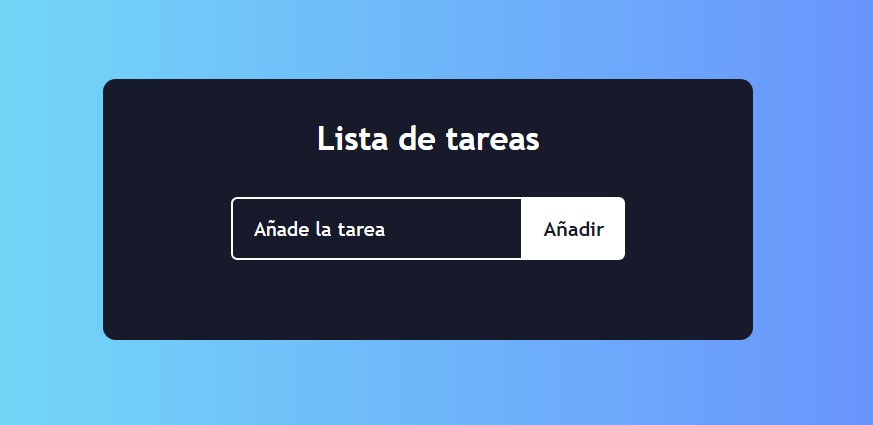
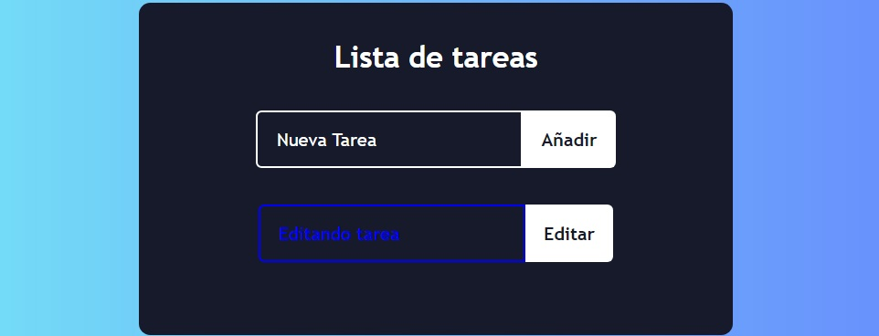
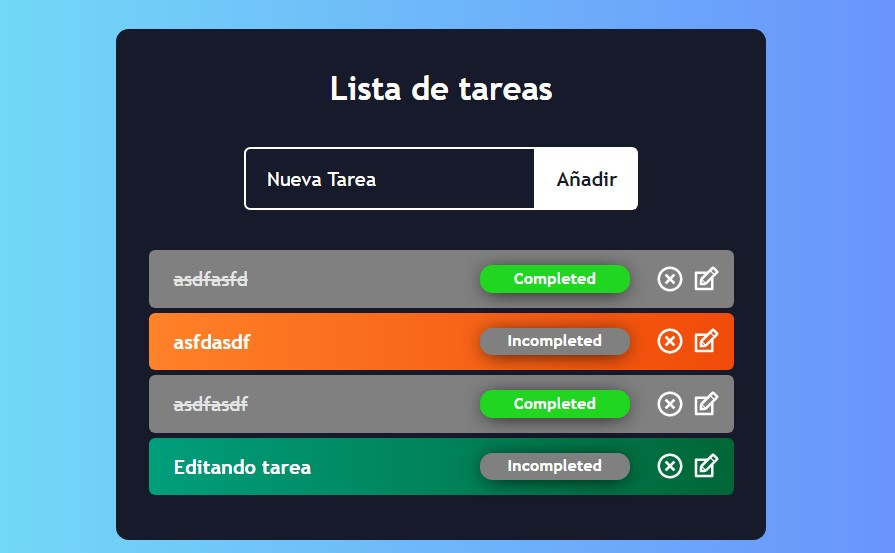

# TodoApp React Assessment Project

## Dependencies installation
### `yarn install`

## Available Scripts

In the project directory, you can run:

### `yarn start`

Open [http://localhost:3000](http://localhost:3000) to view it in the browser.

### `yarn test`

Launches the test runner in the interactive watch mode.\
See the section about [running tests](https://facebook.github.io/create-react-app/docs/running-tests) for more information.

Proyecto creado con [Create React App](https://github.com/facebook/create-react-app).

## Project screenshots

